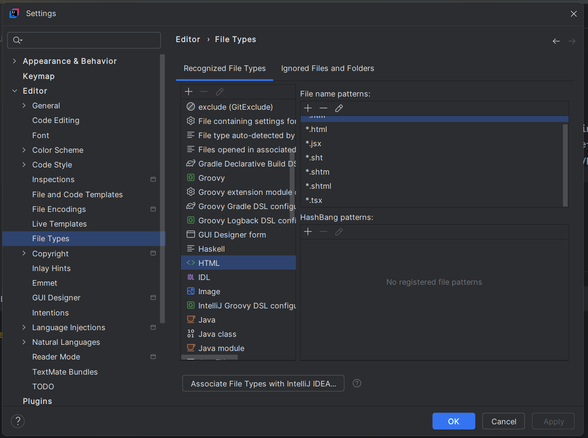
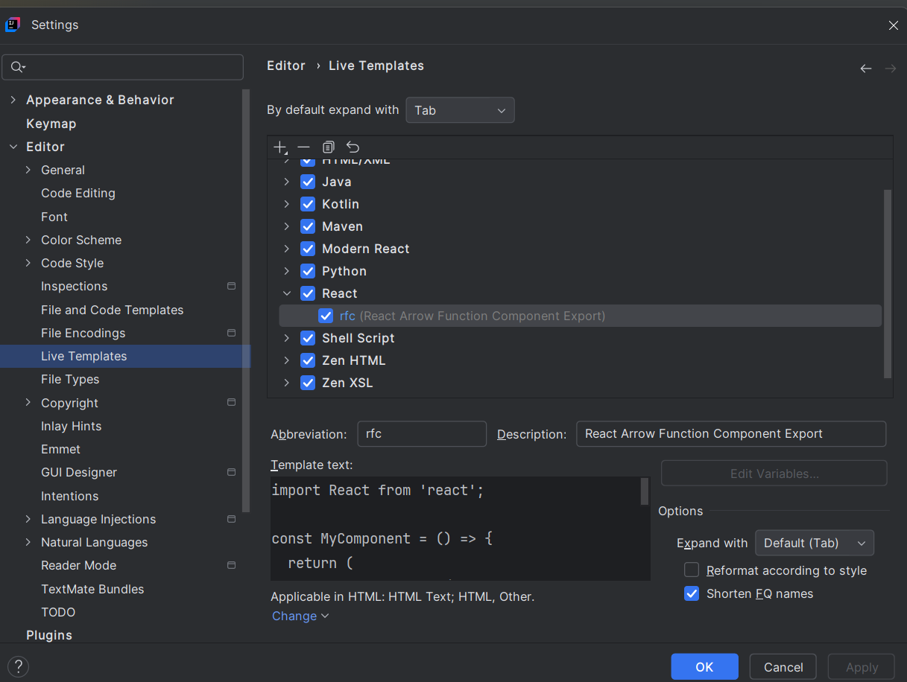
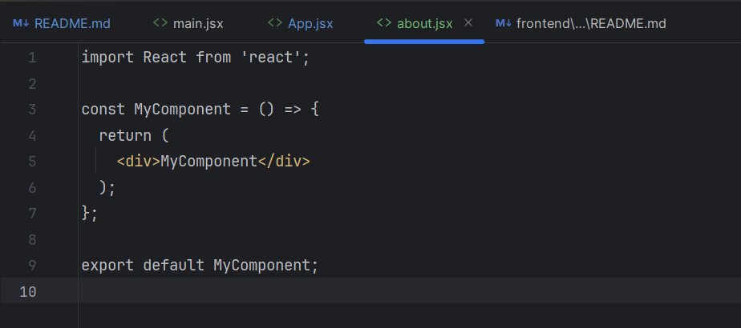

# full-stack-path-sneha
This full stack development path will include JAVA, Spring boot, docker, Mongo, deployment

For React to work with vite, node20+ is required
I have updated the node version and added it to .bashrc and sourced it 

if .idea gets added by mistake in ur repo
git rm -r --cached .idea

since I am working in Intellij community edition which does not recognise JSX TSX 
so what to do is  
apne shortcuts khud se add kr do  
how?  
eg rfc  
Setting -> Editor -> Live Template -> Add a new temmplate (React) -> Now select React -> Add template in this  
U will get a dialog box neeche -> Write about abbreviated name -> description -> code that u want by default to pop up  
since this is community edition which does not recognise JSX TSX so just add the define of this file type in html & others  
Next [VEERY IMPORTANT] DO NOT FORGET to add .jsx and .tsx in ur file type

  
Now Just type `rfc` and tab in ur .jsx file and the boilerplate code which we added will pop up  
  
Well, agr ye sab krne ka man nhi h to shanti se switch to VS Code for ur frontend work

